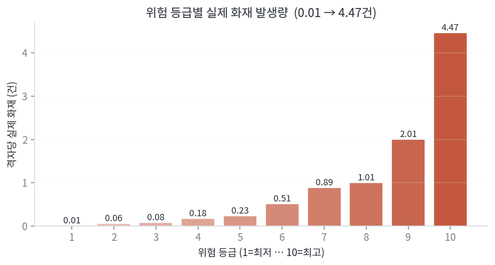
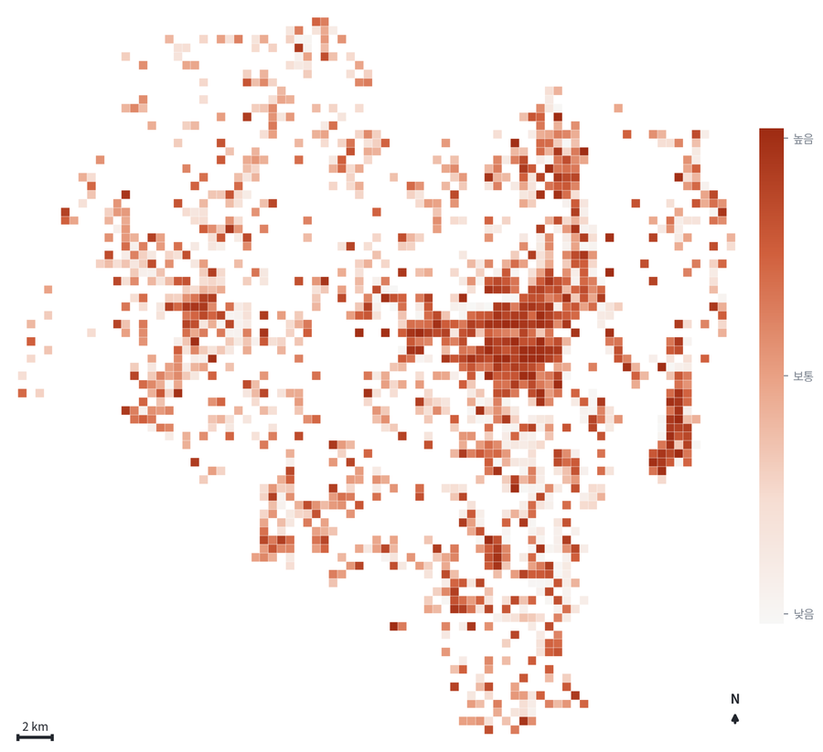
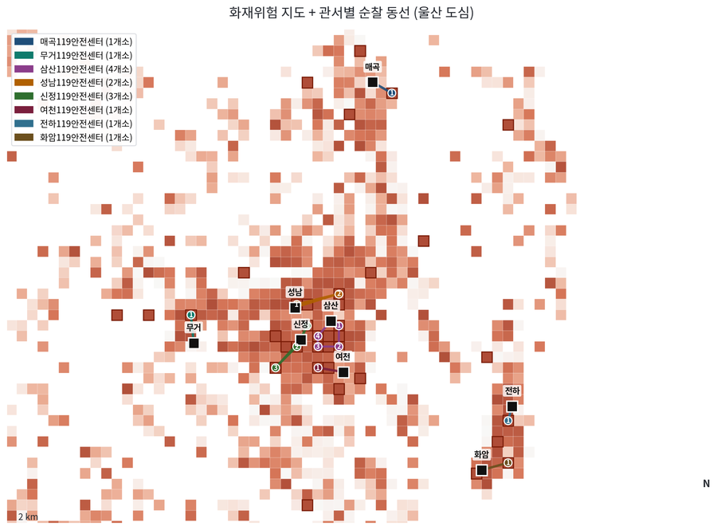
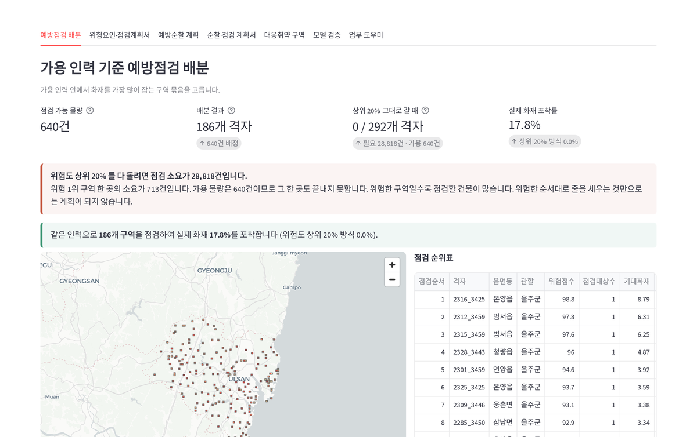
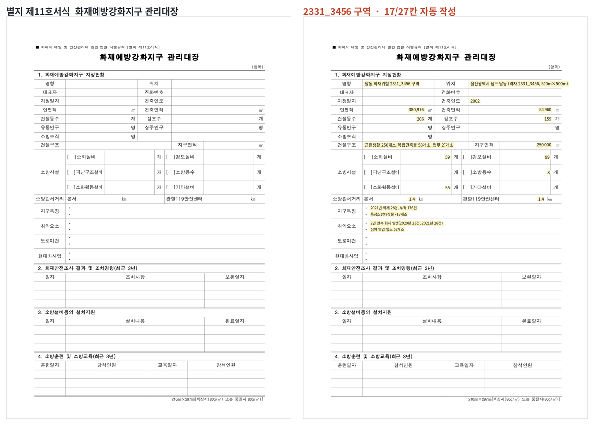

<div align="center">


**한정된 소방 인력으로 이번 달 어디를 먼저 볼 것인가**

화재위험을 예측하는 데서 멈추지 않고, 가용 인력 안에서 실행 가능한
**순찰 경로**와 **결재 가능한 공문**까지 내놓는 의사결정 시스템

제6회 소방안전 빅데이터 활용 및 아이디어 경진대회 · 서비스 개발 부문<br>
박용준 · 아주대학교 산업공학과

</div>

---

## 한 문단 요약

소방 예방행정의 병목은 출동이 아니라 그 앞단 — **한정된 인력으로 무엇을 먼저 볼
것인가** — 이고, 지금은 법정 주기와 담당자 경험으로 정합니다. 불씨예보는 울산
1,459개 구역 · 8년 · 화재 11,863건으로 구역별 화재위험을 예측한 뒤, **점검관 4명이
20일 동안 할 수 있는 일의 양을 제약으로 넣어** 갈 수 있는 구역 묶음을 고르고, 관서별
순찰 동선을 실제 도로 위에서 짜고, 그 결과를 **그대로 결재에 올릴 수 있는 계획서**로
출력합니다.

<table>
<tr><td width="50%">

**예측만 하면 아무 데도 못 갑니다**

가용 인력 640건 · 위험 1위 구역 하나의 점검 소요 712.8건.
위험한 곳일수록 점검할 건물이 많아 비쌉니다.

| 위험 순서대로 | 구역 | 담는 화재 |
|---|---|---|
| 예산 넘으면 중단 | 0개 | **0%** |
| 부분까지 인정 | 0.9개 | **1.8%** |
| 안 들어가면 건너뛰기 | 7개 | **2.9%** |
| **인력 제약 배분** | **186개** | **17.8%** |

</td><td width="50%">



위험 1등급 → 10등급, 구역당 실제 화재 0.01 → 4.47건.
2021년 화재는 학습에 한 건도 쓰지 않았습니다.

</td></tr>
</table>

---

## 화면

<table>
<tr>
<td width="50%"><br>
<sub><b>구역별 화재위험</b> · 500m 격자, 울산 전체 1,459개 구역</sub></td>
<td width="50%"><br>
<sub><b>관서별 순찰 동선</b> · 119안전센터 출발·복귀, 실제 도로 주행거리(OSRM)</sub></td>
</tr>
<tr>
<td><br>
<sub><b>인력에 맞춘 배분</b> · 인원·기간을 넣으면 갈 수 있는 구역만 남습니다</sub></td>
<td><br>
<sub><b>법정 서식</b> · 법제처 원본 괘선 위에 27칸 중 17칸을 채웁니다</sub></td>
</tr>
</table>

---

## 무엇이 다른가

예측 모델을 만든 사례는 국내외에 있습니다. 저희가 찾은 범위에서는 **어느 사례도
'그래서 이번 달에 어디를 돌아라'까지는 가지 않았습니다.**

| | 해외 선행 사례 (Firebird, KDD 2016) | 불씨예보 |
|---|---|---|
| 산출물 | 위험점수 · 지도 시각화 | 위험지도 + **인력 제약 배분** + **관서별 동선** + **공문 계획서** |
| 인력 제약 | 미해결 — 연 점검 6,096건 증가는 "조직·조례·증원 없이는 불가능"하다고 논문이 기술 | 가용 인력 안에서 배분, 동일 인력 대비 **+17.8%p** |
| 문서 | 없음 | 일반기안문 배열 · 법정 별지 서식 · 근거 조문 자동 첨부 |

**① 위험한 순서로 자르지 않습니다** — 구역마다 점검 소요가 다릅니다. 소요 합계가
예산 이내이면서 담기는 화재가 가장 큰 묶음을 고릅니다(배낭 문제). 50개 이상의
무작위 사례를 무차별 대입 최적해와 맞대어 **평균 0.95 이상, 최악 0.5 이상**을
시험이 지킵니다(`tests_firebird/test_operations.py`).

**② 예측 결과가 결재 문서가 됩니다** — 기관·수신·경유·시행일·근거 조문·붙임·결재란까지
공문 서식 그대로 나옵니다. 법정 서식은 법제처 원본 PDF 위에 값만 얹습니다.

**③ AI가 인용한 조문을 기계가 대조합니다** — 숫자·동선·조문은 시스템이 확정하고 LLM은
문장만 다듬습니다. 원문에 없던 수나 조문이 하나라도 생기면 그 결과를 버립니다.
기관 내부 로컬 모델(Ollama)이나 규칙기반으로 대체할 수 있어 폐쇄망에서도 돌아갑니다.

---

## 검증

모든 수치는 `scripts/04_train_eval.py` 의 실측값입니다 (`outputs/evaluation.json`).
2014~2020년으로 학습하고 **2021년 화재는 한 건도 쓰지 않았습니다.**

| 확인한 것 | 질문 | 결과 |
|---|---|---|
| 미래 예측 | 2021년을 맞히는가 | 위험 상위 20%가 그해 화재의 **68.5%** (95% CI 63.5~72.9%) |
| 단순 기준 대비 | 전년 화재 순보다 나은가 | **+5.0%p** (CI +1.6~+8.0%p) |
| 무작위 대비 | | **3.43배** (PAI) |
| 관할 제외 (LOGO) | 특정 구·군만 잘 맞는 것은 아닌가 | 50.9~61.3%, **다섯 관할 전부** 단순 기준 상회 |
| 타 지역 이식 | 울산에서 만든 것이 세종에서도 되는가 | 74.0% (표본이 작아 단순 기준 72.1%와 유의차 없음) |
| 주소 정밀도 | 주소가 거칠어 부풀려진 것은 아닌가 | 도로명 있는 건만으로도 70.8% — 부풀림 없음 |
| 회고 검증 | 그해 이전 자료만으로 짰다면 | 60구역(관내 4.1%)이 그해 화재 **35.9%** 를 담음. 3년 연속 단순 기준 대비 +38~+47건, 신뢰구간 모두 0 초과 |

### 먼저 밝히는 것

**지난 화재 건수만 놓고 줄을 세워도 68.4%가 나옵니다.** 포착률 자체는 이 프로젝트의
자랑거리가 아닙니다. 값은 **같은 인력으로 0%가 17.8%가 되는 쪽**, 그리고 그 결과가
결재 문서로 나온다는 쪽에 있습니다.

되지 않은 것도 재서 기록했습니다 — 건축물대장 노후도를 붙여 봤으나 개선이 없어
(−0.8%p, 신뢰구간 0 포함) 넣지 않았고, 점검이력 88만 행은 결합 키가 없어 쓰지
못했습니다. 자세한 것은 [docs/DATA_REALITY.md](docs/DATA_REALITY.md).

---

## 이 저장소가 스스로 지키는 것

발표 자료와 코드가 따로 놀지 않도록, 사람이 눈으로 확인하던 것을 검사로 옮겼습니다.
`scripts/run_all.sh` 가 파이프라인 끝에서 전부 돌립니다.

| 검사 | 무엇을 막는가 |
|---|---|
| `10_audit_numbers` | 장표의 모든 숫자가 산출물에서 나왔는지. 손으로 적은 값은 출처를 밝혀야 통과 |
| `11_audit_layout` | 도형이 장표 밖으로 나가거나 글이 상자 밖으로 흘러나가는지 |
| `12_audit_docs` | 문서의 수치가 산출물과 어긋나는지. 같은 값을 다르게 적은 곳도 잡음 |
| `19_audit_talk` | 발표자료·대본·영상의 장표 수·길이·자막이 서로 맞는지 |
| `22_audit_aitell` | AI가 쓴 티가 나는 표현(번역투·기계적 열거·과장 어휘) |
| `21_time_script` | 대본 시간표를 손으로 적지 않고 대본에서 잼 |

이 검사들은 실제로 결함을 잡았습니다 — 그림 캡션(17칸)과 본문(13칸)이 갈라진 것,
배분 알고리즘이 비싼 구역 하나 때문에 뒤를 통째로 버리던 것, 계획서 미리보기의
결재란이 마크다운 파싱 오류로 통째로 사라지던 것.

**292개 시험** 이 통과합니다 (`python -m unittest discover -s tests_firebird`).

---

## 빠른 시작

```bash
python -m venv .venv && source .venv/bin/activate
pip install -r requirements.txt
cp .env.example .env          # 카카오·기상청 키 (없으면 캐시로 동작)

# 데이터를 data/raw/ 에 두고
./scripts/run_all.sh          # 적재 → 학습 → 산출물 → 발표자료 → 검증

streamlit run app/streamlit_app.py
```

데이터는 [소방안전 빅데이터 플랫폼](https://www.bigdata-119.kr) 에서 받습니다
(무료·회원가입). 어떤 상품을 받아 어디에 두는지는
[docs/DATA_SOURCES.md](docs/DATA_SOURCES.md), 전체 절차는
[docs/REPRODUCTION.md](docs/REPRODUCTION.md).

원본 컬럼명이 다르면 `configs/schema.yaml` 의 별칭 사전만 고치면 됩니다.

---

## 구조

처음 보신다면 **`src/firebird/operations.py`** (인력 제약 배분) 와
**`src/firebird/plans.py`** (계획서 생성) 부터 보시면 이 프로젝트의 핵심이 보입니다.

```
src/firebird/          라이브러리 30개 모듈
  dataset · features   원본 CSV → 500m 격자×연도 패널 (누수 가드 포함)
  model · evaluate     LightGBM Poisson, 시간분할 / LOGO / 도시이식, 부트스트랩 CI
  operations           ★ 가용 인력 제약 하 배분(배낭) · 형평성 제약 · 대조군
  routing · patrol     ★ OSRM 도로거리, 구역 분할, TSP(2-opt·Or-opt), 왕복 경로
  plans · forms        ★ 공문 계획서 · 법정 별지 서식(원본 PDF 위에 값만 얹기)
  explain · rules      SHAP 요인을 현장 용어로, 업종별 점검 체크리스트
  assistant · lawdata  법령 457개 조문 BM25 색인, 인용 조문 원문 대조
  hydrant · monthly    소화전 사각지대, 월 위험계수(계절 × 기상)

app/streamlit_app.py   대시보드 7화면
scripts/               01~09 파이프라인 · 10~23 검증과 발표 산출물 · run_all.sh
tests_firebird/        292개 시험 (단위 · 통합 · 스크립트 스모크)
docs/                  자료의 실제 상태 · 재현 절차 · 평가 설계 · 실패 사례집
configs/               config.yaml(하이퍼파라미터) · schema.yaml(컬럼 별칭)
```

| 문서 | 내용 |
|---|---|
| [DATA_REALITY.md](docs/DATA_REALITY.md) | 자료가 실제로 어떤 상태였고 무엇이 안 됐는가 |
| [REPRODUCTION.md](docs/REPRODUCTION.md) | 같은 수치를 다시 만드는 절차 |
| [EVAL_DESIGN.md](docs/EVAL_DESIGN.md) | 검증 프로토콜과 그렇게 정한 이유 |
| [DATA_SOURCES.md](docs/DATA_SOURCES.md) | 플랫폼 데이터 상품 8종과 받는 곳 |
| [FAILURE_CATALOG.md](docs/FAILURE_CATALOG.md) | 이 프로젝트에서 실제로 낸 실수와 고친 방법 |

---

## 한계

공개 데이터에 건물번호·좌표가 없어 **구역(500m) 단위**가 해상도 한계입니다. 화재의
63%가 도로명 없이 읍면동 중심 좌표로 배정되는데, 이는 포착률을 **부풀리는 방향**으로
작용합니다 — 그래서 도로명이 있는 건만으로 따로 검증해 성능 저하가 없음을 확인했습니다.

대상물·업소 자료는 현재 시점 스냅숏이라 과거 연도 행에도 같은 값이 들어갑니다(화재
라벨에는 누수가 없습니다). 순찰이 화재를 몇 % 막는지는 **이 저장소로는 측정할 수
없어**, 곱하지 않고 시나리오로만 제시합니다.

전체 목록은 [docs/DATA_REALITY.md](docs/DATA_REALITY.md) 에 있습니다.

---

## 유의

공개 데이터만 사용하며 개인정보를 다루지 않습니다(구역 집계 단위). 법정 서식의
대표자·전화번호 칸은 공개 데이터로 채울 수 있어도 **넣지 않습니다** — 빈칸을
그럴듯하게 메우는 순간 결재 문서가 아니라 추정치가 됩니다.

산출물은 예측 결과이며 법정 점검주기·관할 판단을 대체하지 않습니다.
플랫폼 제공 원자료는 재배포하지 않습니다.
